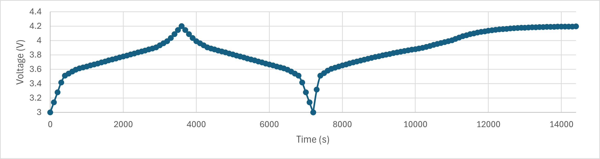

# Cell Emulator

## Description

This is a project designed to simulate battery cell behavior, which might be a time-consuming and high-cost task in research. The project can serve as the first phase in research to obtain the POC (Proof of Concept) before actually starting the battery experiment. It doesn't mean the actual experiment is unnecessary; it just helps you to verify that the results align with your expectations.

## Build

This is a cross-platform project that uses CMake, and there are scripts available for compilation as well.
- On Windows, use `build.bat`
- On macOS/Linux, use `sh build.sh`

## Demo

The demo attempts to simulate an 18650 battery cell with a capacity of 3500mAh and charges it from 0% to 100% using a constant current of 3.5A (equivalent to 1C) and discharge it back to 0% then charging it using constant voltage of 4.2V for two hours.

It will automatically generate a csv log file to document the whole process.
<p align="center">

</p>

## Cutomize

There are two aspects you can customize in the current version:

1. Input a different benchmark spreadsheet for various battery cells. (Future updates will enable input via Excel files.)
2. Customize the test schedule with various currents and time durations. (Future versions will support additional control types, such as constant voltage or CCCV.)
```
int main()
{
    // Step1. Input the benchmark spreadsheet for the cell
    BatteryModel testModel(0, { { 0, 3.0 }, { 10, 3.5 }, { 20, 3.6 }, { 30, 3.65 }, { 40, 3.7 }, { 50, 3.75 }, { 60, 3.8 }, { 70, 3.85 }, { 80, 3.9 }, { 90, 4.0 }, { 100, 4.2 } }, 3500);
    testModel.displayBatteryParams();

    // Step2. Customize the test schedule
    TestSchedule schedule;
    schedule.addStep(TestStep(CONSTANT_CURRENT, 3.5, 3600, 100));
    schedule.addStep(TestStep(CONSTANT_CURRENT, -3.5, 3600, 100));
    schedule.addStep(TestStep(CONSTANT_VOLTAGE, 4.2, 7200, 100));
    
    // Step3. Run the simulation
    SimulationEngine simEng(testModel, schedule);
    simEng.runSimulation();
    
    testModel.displayBatteryParams();
    system("pause");
    return 0;
}
```

## Planned Features

Here are some of the features I plan to implement in the future and tasks:

- [ ] Input via Excel files for a broader range of spreadsheet formats.
- [ ] Enhanced control types for testing, including constant voltage and CCCV (Constant Current Constant Voltage).
- [ ] Implement a more intuitive user interface for easy setup and monitoring of simulations.

Please note that these features are subject to change and may evolve based on project needs and contributions.

## Contributing

Welcome contributions from everyone! If you're interested in helping improve this project, please feel free to fork the repository, make your changes, and submit a pull request. Your contributions are greatly appreciated and will help make this project better for everyone.

If you are an electrochemist and wish to provide optimizations for the simulation engine but are unsure about implementing your ideas in code, you are welcome to add a plain text file to illustrate your ideas. Alternatively, you may include your email address in the file if you prefer. Welcome any method of contribution.